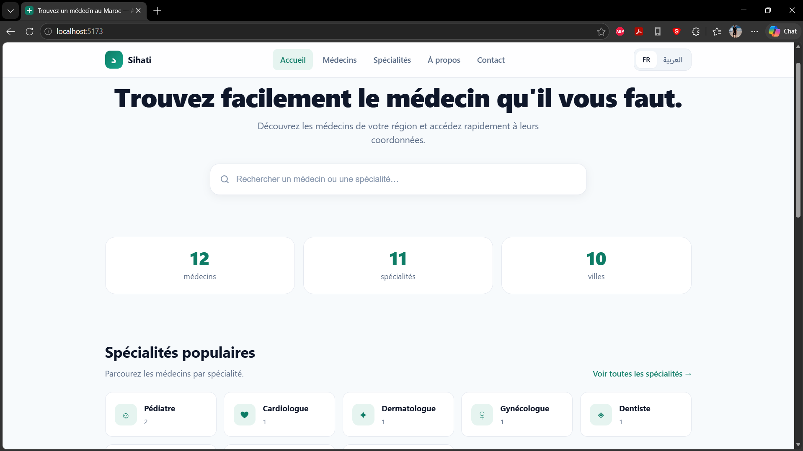
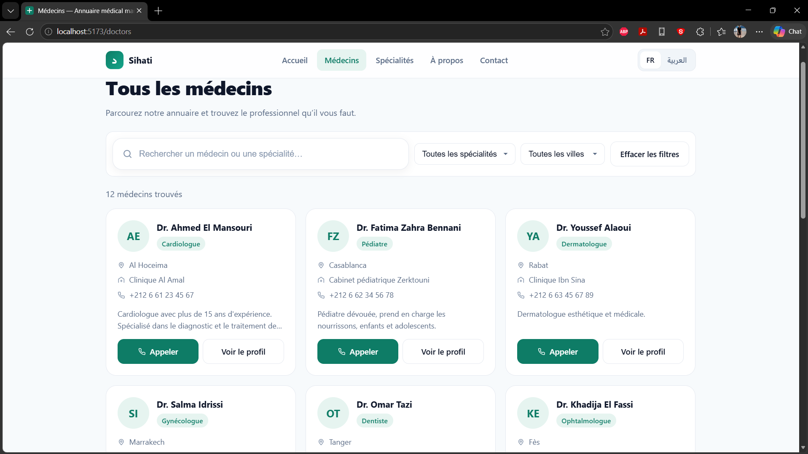
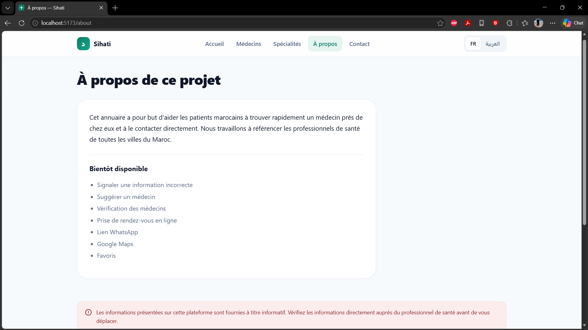
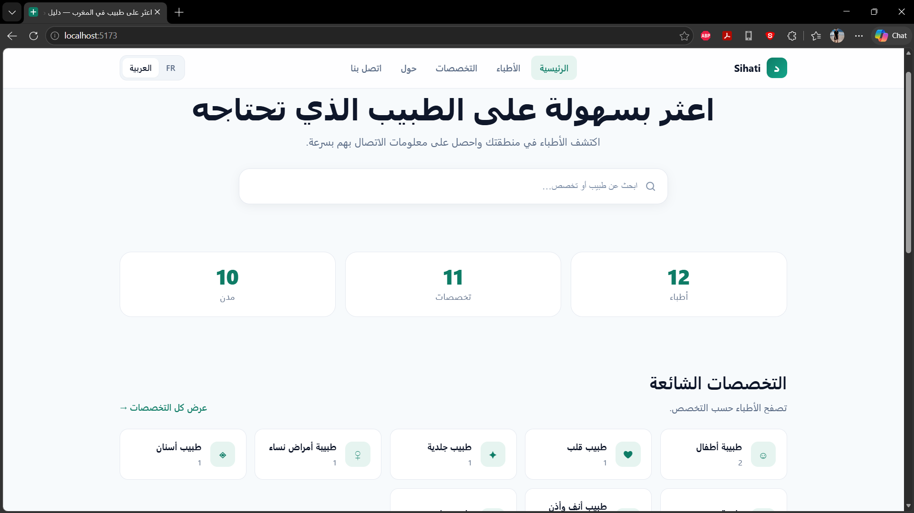

# Sihati — Annuaire médical marocain 🇲🇦

> A bilingual (FR / AR) Moroccan doctor directory. Static, fast, zero-cost.

**V1 is a static public directory. There is no authentication and no CMS yet.**

---

## 📸 Aperçu

| 🏠 Accueil (FR) | 👨‍⚕️ Annuaire |
|---|---|
|  |  |

| ℹ️ À propos | 🌍 Version arabe (RTL) |
|---|---|
|  |  |

---

## 📖 Project

Sihati helps Moroccan patients quickly find doctors by specialty, city, or clinic, and call them in one tap.

- 🌍 French + Arabic (with real RTL layout — not just translated text)
- 📱 Mobile-first, optimized for `tel:` calls
- ⚡ Fully static — no backend, no database, no API keys
- 💰 Deployable for free on Netlify / Vercel / GitHub Pages

---

## ✨ Features

- Homepage with hero search, stats, and featured specialties (all dynamic)
- Searchable, filterable doctor directory (`/doctors`)
- Individual doctor profile pages (`/doctors/:id`)
- Direct call button (`tel:`) on every card and profile
- Optional Google Maps directions link (uses free public maps URL — no API key)
- Language switcher (FR ⇄ AR) that persists across refreshes
- Correct RTL rendering for Arabic (navigation, cards, forms, footer)
- SEO-friendly: dynamic `<title>`, meta description, clean URLs, semantic HTML
- Accessible: keyboard nav, ARIA where needed, focus states, contrast-safe palette

---

## 🛠 Tech stack

| Concern | Choice | Why |
|---|---|---|
| Framework | React 18 + Vite | Fast dev, tiny prod bundle |
| Language | TypeScript | Safe data model |
| Routing | React Router v6 | Standard, well-supported |
| i18n | Custom context | ~50 lines vs. a 30KB library |
| Styling | Plain CSS + design tokens | No runtime cost, RTL via logical properties |
| Data | `data/doctors.json` | Zero-cost, edit-in-place |

No paid services, no paid APIs, no paid hosting.

---

## 🚀 Local development

```bash
# 1. Install
npm install

# 2. Run dev server
npm run dev
# → http://localhost:5173

# 3. Build for production
npm run build

# 4. Preview the production build
npm run preview
```

---

## ➕ Adding doctors (the only file you edit)

Doctor data lives in **`data/doctors.json`**. Nothing else needs to change.

### Steps

1. Open `data/doctors.json`
2. Add a new object to the array
3. Save, commit, push to GitHub
4. Your host auto-redeploys (Vercel/Netlify watch the repo)
5. The doctor appears — no code edits required

### Minimal entry

```json
{
  "id": "dr-ahmed-el-mansouri",
  "name": "Dr. Ahmed El Mansouri",
  "specialty": "Cardiologue",
  "specialtyAr": "طبيب قلب",
  "phone": "+212 6 61 23 45 67",
  "city": "Al Hoceima"
}
```

### Full entry

```json
{
  "id": "dr-ahmed-el-mansouri",
  "name": "Dr. Ahmed El Mansouri",
  "specialty": "Cardiologue",
  "specialtyAr": "طبيب قلب",
  "phone": "+212 6 61 23 45 67",
  "city": "Al Hoceima",
  "address": "12 Avenue Mohammed V, Al Hoceima",
  "clinic": "Clinique Al Amal",
  "description": "Cardiologue avec 15 ans d'expérience…",
  "descriptionAr": "طبيب قلب بخبرة 15 سنة…",
  "openingHours": "Lun–Ven : 9h–17h",
  "image": "https://…/photo.jpg",
  "active": true
}
```

### Rules

| Field | Required | Notes |
|---|---|---|
| `id` | ✅ | Unique, lowercase-dash. Used as the URL slug. |
| `name` | ✅ | Displayed as-is. |
| `specialty` | ✅ | French. Acts as the canonical filter key. |
| `specialtyAr` | ✅ | Arabic label. |
| `phone` | ✅ | International format (`+212…`). |
| `city` | ✅ | Any Moroccan city. Filters are auto-generated. |
| `address`, `clinic`, `description`, `descriptionAr`, `openingHours`, `image` | optional | Simply not rendered if absent. |
| `active` | optional | Set to `false` to hide without deleting. |

> **Missing optional fields will never break the UI.** Every field is checked before rendering.

---

## 🌐 Deployment (free, ~2 minutes)

### Option A — Vercel (recommended)

1. Push your repo to GitHub
2. Go to [vercel.com/new](https://vercel.com/new) → Import repo
3. Framework preset: **Vite** (auto-detected)
4. Click **Deploy**. You get `your-project.vercel.app` for free.

### Option B — Netlify

1. Push to GitHub
2. [app.netlify.com](https://app.netlify.com) → **Add new site → Import from Git**
3. Build command: `npm run build` · Publish dir: `dist`
4. Deploy.

### Option C — GitHub Pages

1. In `vite.config.ts`, set `base: '/your-repo-name/'`
2. Run `npm run build`
3. Publish the `dist/` folder via `gh-pages` or Pages settings

### SPA routing note

Because this is a client-side-routed SPA, add a rewrite rule so deep links like `/doctors/dr-ahmed-el-mansouri` work on refresh:

- **Vercel**: add `vercel.json` → `{ "rewrites": [{ "source": "/(.*)", "destination": "/index.html" }] }`
- **Netlify**: add `public/_redirects` → `/*  /index.html  200`
- **GitHub Pages**: copy `index.html` to `404.html` in `dist/`

---

## 🧭 Architecture

```
src/
├── data/doctors.ts     ← ONLY file that reads doctors.json
├── types/doctor.ts     ← Data model (matches future DB row)
├── utils/search.ts     ← Pure filter logic (no React)
├── locales/            ← All UI strings (fr.ts, ar.ts)
├── i18n/               ← Language provider + hooks
├── components/         ← Reusable UI
├── pages/              ← Route components
└── styles/global.css   ← Design tokens + all styles
```

### Why local JSON for V1?

Because **an MVP doesn't need a database**. It needs to prove the experience. `doctors.json`:

- costs nothing
- has no cold starts
- works offline in dev
- requires no secrets, no schema migrations, no auth
- is trivially editable by a non-developer

The trade-off (no live writes, no multi-user CMS) is acceptable for V1.

### The swap point

Every component imports from `src/data/doctors.ts`, never from JSON directly. To migrate:

```ts
// BEFORE (V1)
import raw from '../../data/doctors.json'
export function getAllDoctors() { return raw }

// AFTER (V2 — same file, different body)
import { supabase } from '../lib/supabase'
export async function getAllDoctors() {
  const { data } = await supabase.from('doctors').select('*').eq('active', true)
  return data ?? []
}
```

Callers change from sync to `async` (a small, mechanical refactor), but no UI logic or layout changes.

---

## 🔮 Future V2 — database + admin

V1 is intentionally shaped so V2 can be added **without a rewrite**:

### 1. Add Supabase (free tier)

- Create a project → a `doctors` table matching `types/doctor.ts`
- Import the JSON rows as seed data

### 2. Replace `src/data/doctors.ts` bodies

- Swap the JSON import for `supabase.from('doctors')` queries
- Mark the functions `async`; update call sites to use `useEffect` / React Query

### 3. Add `/admin`

- Supabase Auth (email/password)
- Protected routes via a `<RequireAuth>` wrapper
- CRUD screens that write to the `doctors` table
- Enable/disable via the existing `active` field (already respected by the data layer)

### 4. Optional extras

- Report-incorrect-info form → `reports` table
- Suggest-a-doctor form → `suggestions` table
- Doctor verification flags
- WhatsApp deep links (`https://wa.me/212…`)
- Favorites (localStorage first, then per-user)

None of these require touching the design system, i18n, or search logic.

---

## 🔒 Security

V1 is a static public directory:

- No auth. No admin. No server. No secrets.
- Anyone can read the data (it ships in the bundle — that's the point).
- Do **not** add a "hidden" admin route to a static site — it isn't secure. Real auth belongs in V2 with a real backend.

---

## ♿ Accessibility

- Semantic landmarks (`header`, `main`, `footer`, `nav`)
- `role="search"` + `role="status"` for live result counts
- Keyboard-navigable menus and filters
- `:focus-visible` rings on all interactive elements
- Colour contrast checked against WCAG AA
- `aria-label` on icon-only controls; `aria-hidden` on decorative SVGs

---

## ⚡ Performance

- Zero UI-kit dependencies
- Inline SVGs instead of an icon library
- `loading="lazy"` on doctor photos
- Client-side filtering (O(n), instant) — comfortable up to several thousand rows
- Vite tree-shaking + code splitting per route out of the box

---

## 📄 License

MIT — free to use, modify, and deploy.